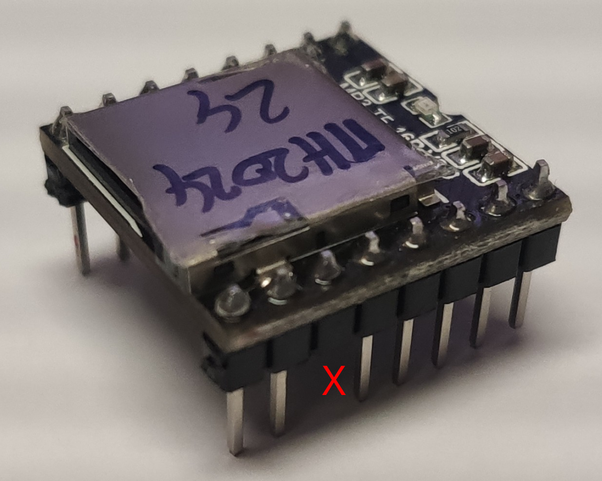

# Sound via "DFPlayer Mini"

> [!IMPORTANT]  
> Owner of mainboard version 0.13.x need to check if the required R7 and R13
> resistors got assembled. 
> They're located on the top side of the PCB, underneath the DFPlayer. 
> If not assembled, you need to solder 1k resistors (otherwise all sounds get played continuously)

> [!IMPORTANT]  
> 
> Users who use any of the DFPlayer-Clones, 
> in an open-mower-mainboard up to version 0.13.x, 
> should cut off Pin-11 from their DFPlayer-Clone. 
> If not, volume control will not work and always play at 100%!  

> [!WARNING]
> Consider about switching your DFPlayer's VCC from 3.3V to 5V
> (via solder jumper JP1 on your OpenMower MainBoard)

**Explanation:** 
I'm with sound since June 2023. 
In the first month, I killed 2 Picos because his tiny Buck-Boost Converter "RT6150" cracked. 
After a short correspondence with Clemens, he pointed me to the DFPlayer
as a possible reason. 
Because: By OM default design, the DFPlayer's VCC is 3.3V (via JP1),
which is provided by the small Buck-Boost Converter on the Pico. 
After I switched my DFPlayer's VCC to 5V (via JP1), I didn't lost any Pico anymore. 
It's not confirmed yet if that really was the reason for my killed Pico's,
and you're invited to validate the assumption by leaving your DFPlayer on 3.3V. **But be warned**, even if the Pico is cheap, it's awful to replace it! 

### Update 10/13/2023

As I was still in doubt if it's really necessary to switch DFPlayer's VCC to 5V,
I did some measuring today:

- Placed an 0.2Ω resistor (4W) within Pico's 3V3 output line
- Measured with an oscilloscope the occuring voltage over the resistor: 
  0.028 VAVG => divided by 0.2Ω = 140mA => looks fine 
  0.195 VPP => divided by 0.2Ω = 975mA => hugh :-/ but this is VPP!
- Within the Pico Datasheet it's written (somewhere), thats allowed to draw up to 300mA
- The specs of the Buck-Boost Converter "RT6150" (used on the Pico) say: 
  "*Up to 800mA Continuous Output Current*", as well as 
  "*... current limit.*"

End of October 2023, I discussed my doubts with Clemens and he answered:
> The short peaks are also what worries me. The overcurrent protection will probably only take effect in the event of a longer overload. That's how you run it above the spec (even if for a short time) and that potentially breaks it at some point

> [!IMPORTANT]  
> You may run `OM_DFP_IS_5V=true` (to get full sound support), even if **not** switched to 5V, but we worry that you might kill your Pico's PMIC after some time

## Sound Buttons

| Custom CoverUI V1 Stock C500(A/B) | Custom CoverUI V2 | RM-ECOW-V1.0.0 (NX80i, ...) | RM-EC3-V1.1 (NX100i) | SA/SC-Pro (240*160 Pixel) | Function |
| ------ | -------- | ---- | ---- | --- | --- |
| <kbd>Mon</kbd> | <kbd>Sun</kbd> | <kbd>4H</kbd> | <kbd>1</kbd> | <kbd>↑</kbd> | Volume up |
| <kbd>Tue</kbd> | <kbd>Mon</kbd> | <kbd>6H</kbd> | <kbd>2</kbd> | <kbd>↓</kbd> | Volume down

## DFPlayer Module / Clones

Beside the original [DFPlayer by DFRobot](https://www.dfrobot.com/product-1121.html) module, there are a couple of "DFPlayer-Mini" clones in the wild.

If you order a "DFPlayer-Mini" by Amazon or the like, there's a >90% chance that you get one of these clones, instead of the original one.

That's why I tried to adapt the code in that way, that some of these clones get also supported.

Check the larger chip on the backside of the module, to verify if your DFPlayer is supported. The following DFPlayer chips are supported/tested at the moment:

- `DFROBOT LISP3` is the one on my original [DFPlayer by DFRobot](https://www.dfrobot.com/product-1121.html) module
- `MH2024K-24SS` which is one of the older clones, whose support is okay
- `AB23A799755` is a newer clone and seem to be supported very well
- `GD3200B` is also one of the newer clones, but partly fail in support!

The used DFPlayer library also indicate support for `YX5200-24SS` and `MH2024K-16SS`, but I couldn't test these by myself. If you've one of these, give it a try.

## SD-Card

Look like all DFPlayer support a SD-Card size up to 32GB.
As we don't have a lot soundfiles (<10MB), choose the smallest one you can find, format it with a FAT32 file system and copy all these [files and folder](./soundfiles/) to your SD-Card.

Do not simply delete all files from an ancient SD-Card which you found in a dusty box! 
These tiny DFPlayer beasts are sensitive to SD-Card trash like orphaned files or unclean FAT tables and tend to loop or hang when initialized. 
Always prefer to cleanly format it with a FAT32 partition!

### Folder/Track Structure

Due to some incompatibilities with the libs and the clone chips, we unfortunately can't use DFPlayer's internal "advert" functionality for our usage.

So we had to trick a little bit with the folder structure:

- OM's old original sounds are now (partly) converted, translated, extended and reside now in a 2 digit, language specific subfolder. They're mainly 'advert' tracks as they're typically spoken adverts, which may interrupt background sounds like noises or music.
- Folder 'mp3' contain background sounds (noises or music), which are hardcoded in the sources.
- The single soundfile in the root folder, is used/required for DFPlayer "auto-play" detection. If you like to change it, you need to take care that the new file is as least 5 seconds long.
