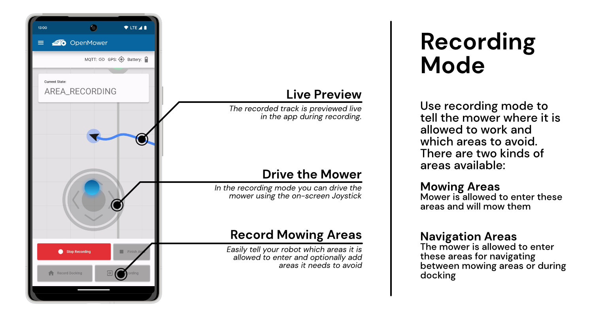
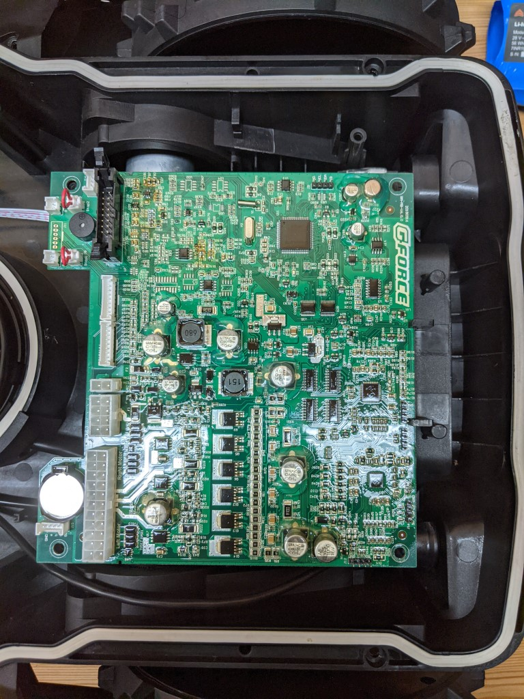

## I am available for hire
Hello! With a background in software engineering, embedded programming, hardware design, and robotics, I'm on the lookout for new challenges.
If you're in search of someone with my skills, let's team up and create something amazing! https://x-tech.online/

 

 

  <a>
    <h1 align="center">OpenMower - The DIY Smart Mowing Robot for Everyone</h1>
    
  </a>

 

  

   
  
<b>Join the Discord server for OpenMower discussion:</b>
  

 
 

> [!WARNING]
> 
<b>DISCLAIMER:</b>

>
> **IF YOU ARE NOT 100% SURE WHAT YOU ARE DOING, PLEASE DON'T TRY THIS AT HOME! ASK IN [DISCORD](https://discord.gg/jE7QNaSxW7), IF YOU HAVE ANY QUESTIONS!**

> [!IMPORTANT]
> 
<b>This project is active!</b>

>
> This is the hardware repository, so it might seem that the project is inactive, since hardware is pretty stable by now.
> Most of the development work is done on the ROS code here: https://github.com/ClemensElflein/open_mower_ros

 

# About the Project

If you want to see a quick overview, you can check out this video:

  

Let's be honest: The current generation of robotic lawn mowers sucks. Basically all of these bots drive in a random direction until they hit the border of the lawn, rotate for a randomized duration and repeat. **I think we can do better!**

Therefore, we have disassembled the cheapest off-the-shelf robotic mower  we could find (YardForce Classic 500) and were surprised that the hardware itself is actually quite decent:
- Geared sensored brushless motors for the wheels
- A sensored brushless motor for the mower motor itself
- The whole construction seems robust, waterproof and all in all thought through
- All components are connected using standard connectors, therefore upgrading the hardware is easily possible.

The bottom line is: The bot itself is surprisingly high quality and doesn't need to be changed at all. **We just need some better software in there**.

## Project Goals

Here is a quick overview of this project's goals:

:heavy_check_mark: **Autonomous Lawn Mowing:** Obviously, the device should be able to mow the lawn automatically.

:heavy_check_mark: **Good Safety:** The device must be safe, e.g. emergency stop if lifted or crashed.

:heavy_check_mark: **No Perimeter Wire Needed:** We want to be flexible and support multiple mowing areas.

:heavy_check_mark: **Low Cost:** It should be cheaper than a mid range off-the-shelf product

:heavy_check_mark: **Open:** I want to share knowledge and enable others to build an OpenMower as well.

:heavy_check_mark: **Nice to Look At:** You should not be ashamed to have an OpenMower mowing your lawn.

:heavy_check_mark: **Avoid Obstacles:** The mower should detect obstacles and avoid them during mowing.

:heavy_check_mark: **Rain Detection:** The device should be able to detect bad weather conditions and pause mowing until they improve.

# Open Mower App

## Current State

The basic mowing function finally works! As you can see in the video, map teaching and mowing work as expected. It even returns to the docking station automatically as soon as the battery gets low and continues once it's recharged.

At this point I can recommend that brave tech savvy users can build one for themselves! Since it's quite an expensive and complex project, please don't be shy and ask if you have any questions. I'm glad to help 🙂

### Hardware

By now we have a stable revision of the mainboard as well as two motor controllers to go with it. The [xESC mini](https://github.com/clemensElflein/xesc) and the [xESC 2040](https://github.com/clemensElflein/xesc2040). I'm currently using the xESC mini for my builds and it works very well. The problem with this controller is, its parts are currently hard to source. That's why we created the xESC 2040 based on the RP2040 chip. This is the low-cost variant and its support is currently experimental.

#### Hardware To-Do:

- [x] Low Level Firmware Implementation
  - [x] Voltage / Current Sense
  - [x] Emergency Stop Button tracking
  - [x] IMU Communication
  - [x] Rain Sensor
  - [x] Charging State
  - [x] Sound Module
  - [x] UI Board Communication
  - [ ] Discharge current for more accurate battery charge estimation
- [X] ROS Hardware Interface

### Software

The basic software is basically done; Our prototype works as intended (but is not able to avoid obstacles yet).

The software for the robot can be found in a separate repository: https://github.com/ClemensElflein/open_mower_ros

#### Software To-Do:

- [x] Mowing State Machine (Docking / Mowing, ...)
- [x] Path Planning
- [ ] Obstacle Avoidance
- [x] App / Visualization

## Getting Started

If you want to read how to get started building a robot for yourself, check the [OpenMower Website](https://openmower.de). There you can find information on which parts to buy, how to install the software and so on. If you find anything missing, please join the Discord server and ask there. Also there's the [OpenMower Wiki](https://wiki.openmower.de) which is written by the community. It has some additional guides and information.

# How You Can Help

You can help by starting an OpenMower build of your own. This helps to validate the concept and helps to create useful documentation for new users.

Additionally, you can help by starring 🌟 and watching 👀 this repository, since it will help with visibility. You can also subscribe to my [YouTube channel](https://youtube.com/c/ClemensElflein).

## Compatible Robotic Mowers

While disassembling the bot, I wondered about its mainboard: Instead of "YardForce" it read "GForce". After checking the internet for "GForce" robots, I found that that very similar looking robotic mowers are sold under the Herkules brand. Naturally I tried to dig deeper and actually found evidence that the mainboard is manufactured by some chinese company (SUMEC Hardware).

It is therefore quite safe to assume that many robot mowers are basically the same device in a different case. This would be a huge win for the community, since this would mean that by making one of those robots smarter, we could upgrade lots of robots.

Therefore it might be a good idea to start a list of compatible devices. So if you have a cheap robotic lawn mower, you can check, if it was already disassembled in the list below. If it's not there, it would be nice of you to check, if it contains the same mainboard as ours and add your robot to the list with some some pictures / model numbers.

### List of Compatible Mowers

By now, some guys have disassembled their mowers and it doesn't look as good as I initially hoped. The GForce boards are basically just used by YardForce and some rebranded versions for the EU market. My exact hardware was only found in the mower I'm using (YardForce Classic 500) and in recently manufactured SA650 ECOs. The SA650 has a different chassis and we don't have a way of mounting the GPS antenna yet. Therefore at the moment, the only compatible mower is mine (the YardForce Classic 500). 

If you want to have a look at the disassembled mowers, check the Google Docs [here](https://docs.google.com/spreadsheets/d/1BX0-KEs5v-VED8-RA4BLE-wRdXHtlmcKy4n9K5vJVAA)

# More Infos

This page only contains the basic overview of the project. To follow my current development state, check out my [Blog](https://x-tech.online/).

# Patents, Local Laws, Liability

Before building a robot based on the designs published here, please make sure that you are allowed to do so in your specific regions.
There may be patents and / or laws prohibiting you of doing so.

The code/schematics/PCB files are distributed in the hope that it will be useful, but WITHOUT ANY WARRANTY; without even the implied warranty of MERCHANTABILITY or FITNESS FOR A PARTICULAR PURPOSE.

This basically means: I'm just documenting a project of mine here for free and I don't have the time and resources to check that devices built using this information will be safe to use, legal to use or even work as intended. You will need technical know-how to use this project and I'm not liable for any damages your devices do to anyone or anything.

# License

 This work is licensed under a <a rel="license" href="http://creativecommons.org/licenses/by-nc-sa/4.0/">Creative Commons Attribution-NonCommercial-ShareAlike 4.0 International License</a>.

Feel free to use the design in your private/educational projects, but don't try to sell the design or products based on it without getting my consent first. The idea here is to share knowledge, not to enable others to simply sell my work. Thank you for understanding.
