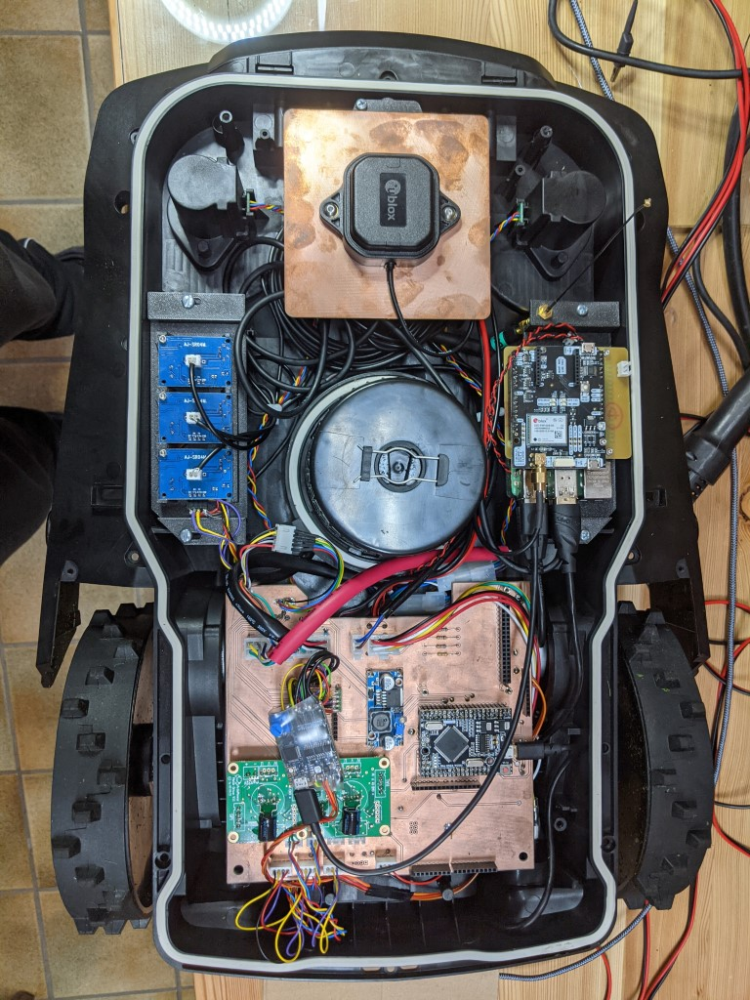

```
[](https://creativecommons.org/licenses/by-nc-sa/4.0/)
```

**:warning: DISCLAIMER:**

**IF YOU ARE NOT 100% SURE WHAT YOU ARE DOING, PLEASE DON'T TRY THIS AT HOME!**


# OpenMower

Let's be honest: The current generation of robotic lawn mowers sucks. Basically all of these bots drive in a random direction until they hit the border of the lawn, rotate for a randomized duration and repeat. **I think we can do better!**


Therefore, we have disassembled the cheapest off-the-shelf robotic mower  we could find (YardForce Classic 500) and were surprised that the hardware itself is actually quite decent:
- Geared sensored brushless motors for the wheels
- A sensored brushless motor for the mower motor itself
- The whole construction seems robust, waterproof and all in all thought through
- All components are connected using standard connectors, therefore upgrading the hardware is easily possible.

The bottom line is: The bot itself is surprisingly high quality and doesn't need to be changed at all. **We just need some better software in there**.


## 

## Challenges
It's not really *that easy* to upgrade the robot, since unfortunately the mainboard used by those bots is proprietary. Therefore the first step is to create a mainboard which then can be used to deploy some better software later on. This is what we are currently working on.


## Current State
Currently, we are working on a mainboard which enables us to drive all actuators and read some sensor data from the bot:





Yes it's messy and therefore not yet published in this repository. Don't worry, I am currently working on creating a cleaner, functional version of this board.


## Compatible Robotic Mowers

While disassembling the bot, I wondered about its mainboard: Instead of "YardForce" it read "GForce". After checking the internet for "GForce" robots, I found that that very similar looking robotic mowers are sold under the Herkules brand. Naturally I tried to dig deeper and actually found evidence that the mainboard is manufactured by some chinese company (SUMTEC Hardware).


It is therefore quite safe to assume that many robot mowers are **basically the same device in a different case**. This would be a huge win for the community, since this would mean that by making one of those robots smarter, we could upgrade **A LOT OF ROBOTS!**

Therefore it might be a good idea to start a list of compatible devices. So if you have a cheap robotic lawn mower, it would be nice of you to check, if it contains the same mainboard as ours and send me some pictures / model numbers.