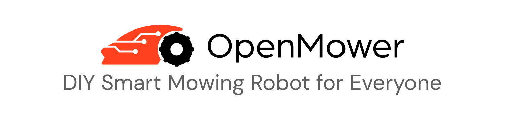
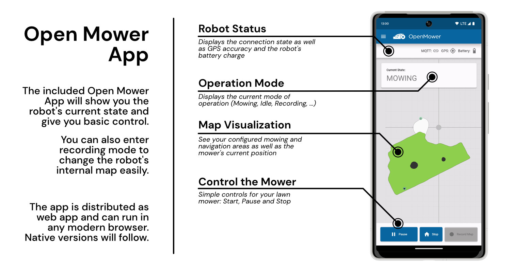
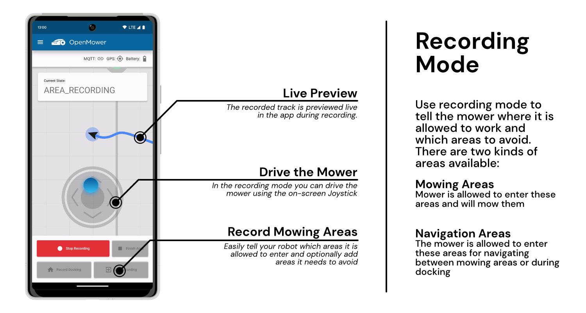

<p align="center">
  <a>
    <h1 align="center">OpenMower - The DIY Smart Mowing Robot for Everyone</h1>
    
  </a>
</p>
<br>
<p align="center">
  <a href="#license"></a>
</p>
<br>
<p align="center"><b>Join the Discord server for OpenMower discussion:</b></p>
<p align="center"><a href="https://discord.gg/jE7QNaSxW7" target="_blank"></a></p>
<br>
<br>

> [!WARNING]
> <p align="center"><b>DISCLAIMER:</b></p>
>
> **IF YOU ARE NOT 100% SURE WHAT YOU ARE DOING, PLEASE DON'T TRY THIS AT HOME! ASK IN [DISCORD](https://discord.gg/jE7QNaSxW7), IF YOU HAVE ANY QUESTIONS!**

> [!IMPORTANT]
> ### New users: start here → [openmower.de](https://openmower.de)
>
> This repository is the central entry point for the OpenMower project. The actual code, firmware and hardware designs live in dedicated repositories — see the [Ecosystem](#ecosystem) section below.

<br>

# About the Project

If you want to see a quick overview, check out this video:

<p align="center">
  <a href="https://www.youtube.com/watch?v=BSF04i3zNGw" target="_blank"></a>
</p>

Let's be honest: The current generation of robotic lawn mowers sucks. Basically all of these bots drive in a random direction until they hit the border of the lawn, rotate for a randomized duration and repeat. **We can do better.**

OpenMower started by disassembling the cheapest off-the-shelf robotic mower we could find (YardForce Classic 500) and replacing its brain with custom hardware and open-source software — turning a dumb random-walk robot into a GPS-guided, map-aware, app-controlled mowing machine.

## Project Goals

:heavy_check_mark: **Autonomous Lawn Mowing:** The device mows the lawn automatically.

:heavy_check_mark: **Good Safety:** Emergency stop if lifted or crashed.

:heavy_check_mark: **No Perimeter Wire Needed:** Flexible support for multiple mowing areas.

:heavy_check_mark: **Low Cost:** Cheaper than a mid-range off-the-shelf product.

:heavy_check_mark: **Open:** Share knowledge and enable others to build their own OpenMower.

:heavy_check_mark: **Nice to Look At:** You should not be ashamed to have an OpenMower mowing your lawn.

:heavy_check_mark: **Avoid Obstacles:** Detect and avoid obstacles during mowing.

:heavy_check_mark: **Rain Detection:** Detect bad weather and pause until conditions improve.

<br>

# Open Mower App





<br>

# Getting Started

**Full documentation and step-by-step build guide:** [openmower.de](https://openmower.de)

The docs cover everything: compatibility checks, hardware shopping list (~€700 excl. mower and RTK base station), robot modification, software setup, and recording your mowing areas.

Before buying anything, read the [System Architecture overview](https://openmower.de/latest/docs/system-architecture/) and the [Step by Step Guide](https://openmower.de/latest/docs/step-by-step-guide/). The build requires intermediate electronics, Linux, and mechanical skills and typically takes a weekend for a YardForce-class mower.

**Need help?** Join the [Discord](https://discord.gg/jE7QNaSxW7) — 2000+ members, active community.

<br>

# Ecosystem

OpenMower is split across purpose-specific repositories, included here as submodules. Clone everything at once:

```bash
git clone --recursive https://github.com/ClemensElflein/OpenMower
```

Or fetch submodules after an existing clone:

```bash
git submodule update --init --recursive
```

## Software

| Repository | Local path | Description |
|---|---|---|
| [ClemensElflein/open_mower_ros](https://github.com/ClemensElflein/open_mower_ros) | `software/open_mower_ros` | ROS navigation, planning and state machine |
| [xtech/openmower-app](https://github.com/xtech/openmower-app) | `software/openmower-app` | Mobile and web app |
| [ClemensElflein/OpenMowerOS](https://github.com/ClemensElflein/OpenMowerOS) | `software/OpenMowerOS` | Operating system image |

## Firmware

| Repository | Local path | Description |
|---|---|---|
| [xtech/fw-openmower-v2](https://github.com/xtech/fw-openmower-v2) | `firmware/fw-openmower-v2` | Mainboard firmware — motor control, sensors, hardware abstraction |
| [ClemensElflein/xesc_firmware](https://github.com/ClemensElflein/xesc_firmware) | `firmware/xesc_firmware` | xESC motor controller firmware |

## Hardware

| Repository | Local path | Description |
|---|---|---|
| [xtech/hw-openmower-universal](https://github.com/xtech/hw-openmower-universal) | `hardware/hw-openmower-universal` | Universal mainboard |
| [xtech/hw-openmower-yardforce](https://github.com/xtech/hw-openmower-yardforce) | `hardware/hw-openmower-yardforce` | YardForce-specific mainboard |
| [xtech/hw-openmower-sabo](https://github.com/xtech/hw-openmower-sabo) | `hardware/hw-openmower-sabo` | Sabo / John Deere mainboard |

<br>

# Compatible Robotic Mowers

Many robotic mowers share the same underlying hardware manufactured by SUMEC Hardware, sold under brands like YardForce, Herkules, and others. By upgrading one of these robots, a large number of devices become OpenMower-capable.

Check the [openmower website](https://openmower.de/latest/docs/getting-started/#is-your-mower-compatible) to check, if your mower is compatible.

<br>

# How You Can Help

- **Build one** — validates the concept and generates useful documentation for others
- **Star ⭐ and watch 👀** this repository — helps with visibility
- **Contribute** — see [CONTRIBUTING.md](./CONTRIBUTING.md)
- **Support** — subscribe to the [YouTube channel](https://youtube.com/c/ClemensElflein)

<br>

# Patents, Local Laws, Liability

Before building a robot based on the designs published here, make sure you are allowed to do so in your specific region. There may be patents and/or laws prohibiting it.

The code/schematics/PCB files are distributed in the hope that they will be useful, but **WITHOUT ANY WARRANTY**; without even the implied warranty of MERCHANTABILITY or FITNESS FOR A PARTICULAR PURPOSE.

This is a documentation of a personal project, shared freely. I am not liable for any damages your devices cause to anyone or anything. You will need real technical know-how to use this project.

# License

**Licenses differ across the project.** Software repositories (ROS, app, OS, firmware) are generally licensed under GPL or MIT — check the `LICENSE` file in each individual repository before use.

This repository documentation is licensed under:

<a rel="license" href="http://creativecommons.org/licenses/by-nc-sa/4.0/"></a><br /><a rel="license" href="http://creativecommons.org/licenses/by-nc-sa/4.0/">Creative Commons Attribution-NonCommercial-ShareAlike 4.0 International</a>.

Feel free to use the design in private/educational projects. Don't sell the design or products based on it without consent. The goal is to share knowledge, not to enable others to sell this work.
