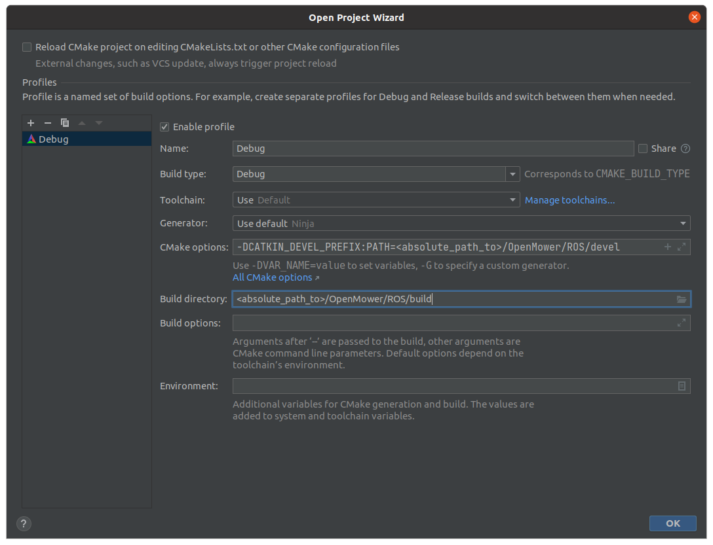

# ROS Workspace
This folder is the ROS workspace, which should be used to build the OpenMower ROS software.

It contains a reference to other repositories needed to build the software. This way, we can track the exact version of the packages used in each release to ensure package compatibility.


Currently, the following repositories are included:

- **open_mower_ros**: The main OpenMower ROS implementation
- **slic3r_coverage_planner**: A coverage planner based on the Slic3r software for 3d printers. This is used to plan the mowing path.
- **teb_local_planner**: The local planner which allows the robot to avoid obstacles and follow the global path using kinematic constraints.
- **xesc_ros**: The ROS interface for the xESC motor controllers.


# Fetch Dependencies 
Before building, you need to fetch this project's dependencies. The best way to do this is by using rosdep:

```bash
sudo apt install python3-rosdep
sudo rosdep init
rosdep update

# run this in the ROS directory
rosdep install --from-paths src --ignore-src
```


# How to Build

Just build as any other ROS workspace: `catkin make`


# How to Build Using CLion IDE

First, launch CLion in a sourced environment. For this I use the following bash file:

```bash
#!/bin/zsh

source <your_absolute_path_to>/OpenMower/ROS/devel/setup.zsh

# You can find this path in the Jetbrains Toolbox
nohup <your_absolute_path_to>/clion.sh >/dev/null 2>&1 &
```


Then, open the `OpenMower/ROS/src` file. CLion will prompt with the following screen:



Copy the settings for **Build directory** and **CMake options**. Everything else can stay the same. This is all you need!
