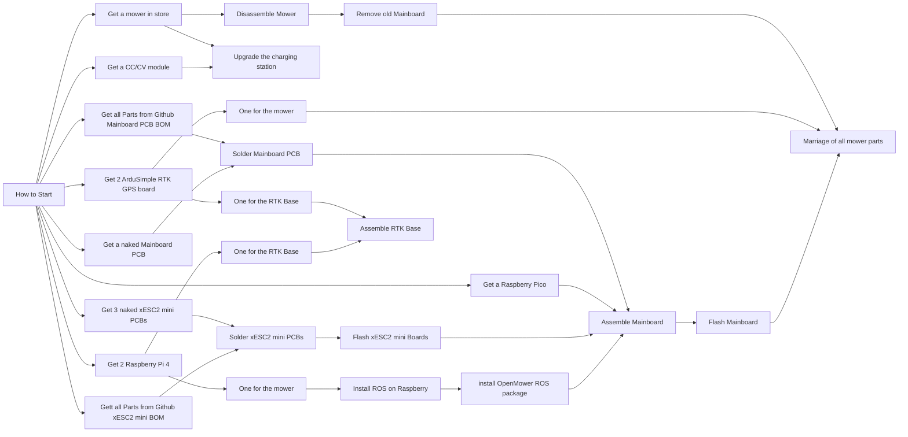

# Project Overview

This diagram should help you to get an overview how to build this project. Note that I'm actively working on step-by-step instructions for all the steps needed.

```mermaid
  graph LR;
      id1[How to Start]-->id2[Get a mower in store];
      id2-->id14[Disassemble Mower];
      id14-->id15[Remove old Mainboard];
      
      id2-->id22[Upgrade the charging station];
      id1-->id23[Get a CC/CV module];
      id23-->id22;
      
      id1-->id3[Get a naked Mainboard PCB];
      
      id1-->id4[Get 3 naked xESC2 mini PCBs];
      id1-->id11[Gett all Parts from Github xESC2 mini BOM];
      id1-->id5[Get 2 ArduSimple RTK GPS board];
      id1-->id6[Get 2 Raspberry Pi 4];
      id1-->id7[Get a Raspberry Pico];
      id1-->id9;

      id6-->id21[One for the mower];
      id8-->id10[Assemble Mainboard];
      
      id4-->id12[Solder xESC2 mini PCBs];
      id11-->id12;
      id12-->id13[Flash xESC2 mini Boards];
      id7-->id10;
      id13-->id10;
      
      
      id15-->id16[Marriage of all mower parts];
      id10-->id18;
      id5-->id17[One for the mower];
      id17-->id16;
      id18[Flash Mainboard]-->id16;
     
      id19[Install ROS on Raspberry]-->id20[install OpenMower ROS package];
      id21-->id19;
      id20-->id10;
      

      id5-->id24[One for the RTK Base];
      id6-->id25[One for the RTK Base];
      id24-->id26[Assemble RTK Base];
      id25-->id26[Assemble RTK Base];
      
      id9[Get all Parts from Github Mainboard PCB BOM]-->id8;
      id3-->id8[Solder Mainboard PCB];
```