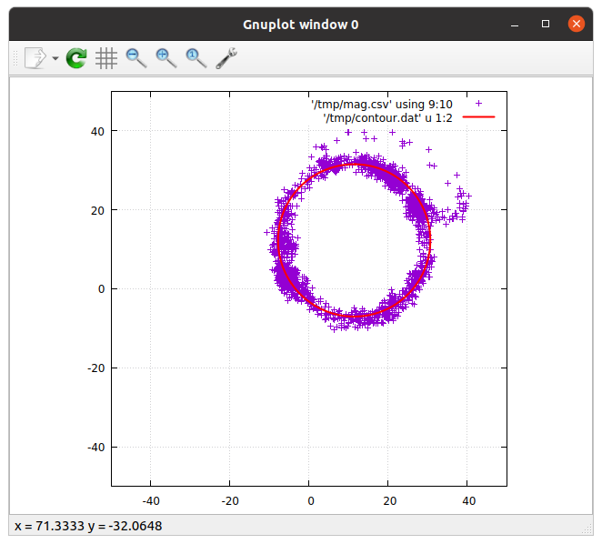

# Magnetometer Calibration

In an ideal word, when we rotate our robot around the Z axis, our magnetometer values would create a circle around the origin. Unfortunately, in the real world, due to magnetic fields in the robot and sensor bias, this is **not the case**. The magnetometer will most likely be an ellipse or a circle with some offset from the origin.

**This calibration will remove this offset, but won't remove any elliptical form!**


## How I'm currently doing this

Currently, I am doing it in the following way:

1. Put the robot in your lawn (turned on, fully assembled)
2. Start a teleop + recording session. Rotate the robot slowly in one spot for several rotations.
3. Run the plot_mag.sh script: `./plot_mag.sh /path/to/your.bag`
4. Check in the interactive plot, if your values are circular and if the fitted circle (red circle) is a good fit.
5. If everything seems fine, your bias values will be printed in the console (see example below).


## Example




This is the output of my calibration run today.

Note that:

1. The outliers have been rejected
2. The plot is pretty much a circle, moved to the upper right hand side


The console output was the following:

```bash
[...]

After 3 iterations the fit converged.
final sum of squares of residuals : 8.48886e+07
rel. change during last iteration : -4.36383e-06

degrees of freedom    (FIT_NDF)                        : 16540
rms of residuals      (FIT_STDFIT) = sqrt(WSSR/ndf)    : 71.6402
variance of residuals (reduced chisquare) = WSSR/ndf   : 5132.32

Final set of parameters            Asymptotic Standard Error
=======================            ==========================
bx              = 11.4452          +/- 0.0209       (0.1826%)
by              = 12.2336          +/- 0.02425      (0.1982%)
r               = 370.698          +/- 0.5595       (0.1509%)

correlation matrix of the fit parameters:
                bx     by     r      
bx              1.000 
by             -0.402  1.000 
r               0.092 -0.020  1.000 
```


**--> Our bias parameters (bx, by) are 11.4452 and 12.2336**


## Better Calibration

This assumes that the result will be a circle with an offset. In reality, the result could be an ellipse. Also it would be nice to automate this process.
